# KERQON

  <picture>
    <source media="(prefers-color-scheme: light)" srcset="media/logo_horizontal_light.png" />
    
  </picture>

  <strong>Your infrastructure. Fully visible. Centrally controlled.</strong> 
  Discover what exists. Understand how it connects. Operate it without logging into every node. 
  <a href="https://kerqon.de">kerqon.de</a>

  Early development — source code will be published with the first public KERQON release.

---

**KERQON** is a **self-hosted infrastructure management platform**.

One control plane. Connected agents. A deep operational model of your nodes — owned and operated by you.

**Discover → Understand → Secure → Control**

KERQON is not a monitoring-dashboard substitute, not a server list, and not a remote-shell tool. Visibility matters — but the product direction is full infrastructure understanding and controlled central management.

---

## Control plane

  

KERQON connects nodes through agents to a central control plane.

From there, operators get a shared operational context across the estate:

- **Visibility** — inventory, health, metrics, and relationships
- **Management** — one place to work with connected nodes
- **Security** — authenticated identity and constrained trust boundaries
- **Operations** — controlled actions where the platform supports them

Agents initiate outbound connections. Managed nodes do not need inbound management ports for KERQON control.

---

## What KERQON actually does

KERQON is built to make infrastructure:

1. **Discoverable** — what exists on and around a node
2. **Understandable** — how interfaces, services, routes, and peers relate
3. **Secure by constraint** — identity, mTLS, authorization, fail-closed verification
4. **Controllable** — central actions without logging into every machine by default

Depending on the surface available in a given release, that includes host identity, network and exposure context, services and runtime signals, topology relationships, metrics and health, lifecycle/update context, and controlled operational actions where supported.

---

## Deep node model

  

**Every connected node. One control plane.**

KERQON aims to model a node as an operable system — not as a CPU/RAM chart.

Core domains in the product model:

| Domain | Examples |
| ------ | -------- |
| **Identity** | Hostname, OS/kernel, hardware |
| **Network** | Interfaces, IPs, routes, DNS |
| **Exposure** | Listening ports, bindings, services, certificates |
| **Connectivity** | LAN, VPN/overlay, peers, gateways |
| **Runtime** | Services, processes, containers |
| **Storage** | Disks, mounts, volumes |
| **State** | Metrics, health, events, updates |
| **Operations** | Configure, restart, update, deploy, secure |

Some domains are already part of the core platform direction and implementation path; others continue to expand. The README does not claim every domain is production-complete today.

---

## Central control without direct node access

Operators should not need to log into every node individually.

KERQON’s intended operating model is central, controlled management through the authenticated agent channel — not an unrestricted remote shell.

The control plane authorizes work. The agent executes within constrained boundaries. Results and state return into the shared operational view.

Examples of the operations surface (current capability vs expanding direction, depending on release):

- service management
- updates
- config deployment
- network changes
- VPN management
- certificate operations
- controlled restart/reboot
- plugin management

Where operations exist, they are meant to be **structured**, **authorized**, and **auditable** — not ad-hoc root access packaged as a product feature.

---

## Security by design

**Security is not an add-on to KERQON. It is a constraint on how the platform is designed.**

  

Platform constraints include:

- **Authenticated agent identity** — agents enroll and operate with cryptographic identity
- **mTLS** — mutual authentication for agent-to-control-plane traffic
- **Outbound-initiated agents** — no inbound management ports required on nodes for KERQON control
- **Central authorization / RBAC** — operator actions are authorized in the control plane
- **Controlled operations** — typed, bounded actions instead of unrestricted remote shell as the default model
- **Least privilege** — agents and plugins are designed to run with constrained permissions
- **Auditable actions** — sensitive operational paths are intended to be traceable
- **Signed releases (Ed25519)** — release artifacts are signed against trusted keys
- **Artifact integrity (SHA-256)** — published artifacts can be hash-verified
- **Fail-closed verification** — invalid identity, revocation, or failed verification does not remain trusted
- **Bounded plugins** — declared capabilities, isolation, and validation boundaries

See [SECURITY.md](SECURITY.md) for reporting guidance.

---

## Self-hosted ownership

KERQON is designed for operators who want ownership of the stack they depend on:

- your control plane
- your nodes
- your infrastructure
- your data

Self-hosting is the baseline — not an afterthought.

---

## Extensibility

Product logic extends through a **bounded plugin model**:

- declared capabilities
- isolated execution boundaries
- schema-validated outputs
- operator-controlled enablement

Plugins extend what KERQON can observe and integrate — they are not a bypass around security or operational constraints.

---

## Open source & licensing

KERQON uses a **split license model**:

- platform core under **AGPL-3.0**
- selected ecosystem components under **Apache-2.0**

See [NOTICE](NOTICE) and [LICENSE](LICENSE).

---

## Development status

**KERQON is currently in private development.**

This public repository intentionally contains **no product source code**.

Source appears only with the first deliberately published public release. Until then, this repository is the public face for branding, community files, and coordination.

Announcements: [kerqon.de](https://kerqon.de)

---

## Community & security

- Security reports: [SECURITY.md](SECURITY.md)
- Contributing: [CONTRIBUTING.md](CONTRIBUTING.md)
- Code of conduct: [CODE_OF_CONDUCT.md](CODE_OF_CONDUCT.md)

Please do **not** publish security vulnerabilities as public GitHub issues.

---

  © KERQON · <a href="https://kerqon.de">kerqon.de</a> · Source code will be published with the first public KERQON release.

