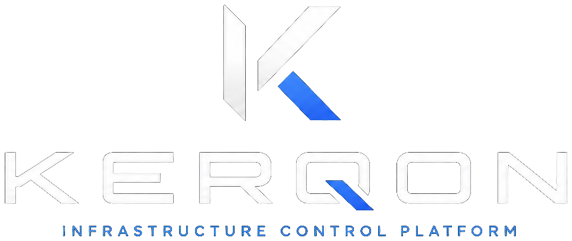

# KERQON

  <picture>
    <source media="(prefers-color-scheme: light)" srcset="media/logo_horizontal_light.png" />
    
  </picture>

  <strong>Self-hosted Infrastructure Management Platform</strong> 
  Discover → Understand → Secure → Control 
  <a href="https://kerqon.de">kerqon.de</a>

  Currently in private development — source code will be published with the first public KERQON release.

---

KERQON is a self-hosted infrastructure control plane designed to discover, understand, secure, and centrally operate Linux systems across local and remote networks — without requiring operators to routinely log in to every node.

The goal is not another monitoring dashboard. KERQON is designed as a control plane that understands infrastructure deeply enough to operate it safely.

---

## Development status

**KERQON is currently in private development.**

This public repository intentionally contains **no product source code** today. It serves as the public face for branding, community coordination, and future release publishing.

Source code will appear with the first deliberately published public KERQON release. Installation and operational documentation will follow when a public release is available.

Announcements: [kerqon.de](https://kerqon.de)

---

## What is KERQON?

KERQON connects managed nodes through outbound-initiated agents to a central control plane you operate.

Operators get a shared operational context across their estate — not a server list, not a remote-shell convenience tool, and not a monitoring-dashboard substitute. Visibility matters, but the product direction is deep infrastructure understanding and controlled central management.

**Discover → Understand → Secure → Control**

---

## Discover

KERQON is built to capture deep node context over time. The product model includes, among other domains:

- host identity, OS/kernel, and hardware context
- interfaces, IP addresses, routes, and DNS
- listening ports, bindings, exposure, and certificates
- services, processes, and containers
- storage, mounts, and volumes
- VPN relationships and remote reachability
- health, metrics, and operational state

Not every domain is production-complete today. The README distinguishes current platform direction from areas still expanding.

---

## Understand

KERQON aims to model relationships — not isolated metrics.

That includes network topology, route relationships, exposure context, service dependencies, VPN peers, remote networks, and what can reach a node versus what a node can reach.

The long-term questions are not only “what is running?” but also “what can reach this system?” and “what can this system reach?”

---

## Control

Managed nodes are intended to be operated through the control plane — not only observed.

Authorized operations are designed to run over an authenticated agent channel with scoped authorization, constrained execution, and structured results returned to the shared operational view.

**Product direction** includes central administration such as service management, container operations, controlled terminal access, port exposure, network and route changes, VPN relationships, updates, and lifecycle operations — without operators switching to every node for routine work.

Where operations exist in a given release, they are meant to be structured, authorized, and auditable — not unrestricted root access packaged as a product feature.

---

## Capability overview

| Discover | Understand | Control | Secure |
| --- | --- | --- | --- |
| Hosts & hardware | Topology & relationships | Services & containers | mTLS agent channel |
| Interfaces & IPs | Exposure context | Controlled terminal | Authenticated agent identity |
| Routes & DNS | VPN & remote reachability | Ports & exposure | Scoped authorization |
| Ports & services | Runtime dependencies | Routes & VPN changes | Least privilege |
| Containers & runtime | Operational context | Updates & lifecycle | Signed releases |
| Storage & health | Remote networks | Structured operations | Self-hosted data ownership |

Treat this table as product direction unless a specific release documents otherwise.

---

## Security by architecture

Security is a design constraint for KERQON — not a marketing add-on.

Architectural principles and targets include:

- **Self-hosted ownership** — your control plane, nodes, infrastructure, and data
- **Outbound-initiated agents** — no inbound management ports required on nodes for KERQON control
- **Mutual TLS** and **authenticated agent identities**
- **Scoped authorization** with least privilege
- **No unrestricted remote shell by default** — controlled operations instead
- **Signed releases (Ed25519)** and **artifact integrity (SHA-256)**
- **Fail-closed verification** when identity or trust checks do not pass
- **Auditable administrative actions** on sensitive operational paths

See [SECURITY.md](SECURITY.md) for vulnerability reporting.

---

## Self-hosted

KERQON is designed for operators who want ownership of the stack they depend on. Self-hosting is the baseline — not an afterthought.

Rich product visuals and UI demonstrations belong primarily on [kerqon.de](https://kerqon.de) as the product matures.

---

## Extensibility

Product logic extends through a **bounded plugin model**:

- declared capabilities
- isolated execution boundaries
- schema-validated outputs
- operator-controlled enablement

Plugins extend observation and integration — they are not a bypass around security or operational constraints.

---

## Architecture & technology

KERQON is a multi-component platform: agents on managed nodes, a central control plane, schema-validated APIs, and bounded plugins.

Detailed architecture documentation will ship with public source releases. This repository does not publish implementation internals during private development.

---

## Open source & licensing

KERQON uses a **split license model**:

- platform core under **AGPL-3.0**
- selected ecosystem components under **Apache-2.0**

See [NOTICE](NOTICE) and [LICENSE](LICENSE).

---

## Community

- Security reports: [SECURITY.md](SECURITY.md)
- Contributing: [CONTRIBUTING.md](CONTRIBUTING.md)
- Code of conduct: [CODE_OF_CONDUCT.md](CODE_OF_CONDUCT.md)

Please do **not** publish security vulnerabilities as public GitHub issues.

---

## Installation & documentation

No public installation guide is available yet. Documentation will be published alongside the first public source release.

---

  © KERQON · <a href="https://kerqon.de">kerqon.de</a> · Source code will be published with the first public KERQON release.

